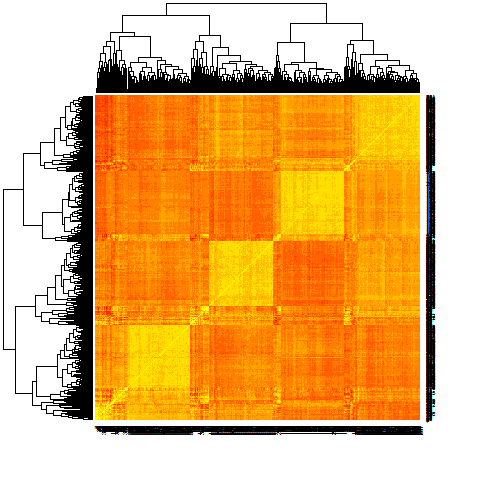
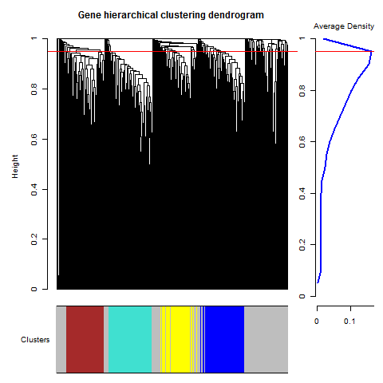
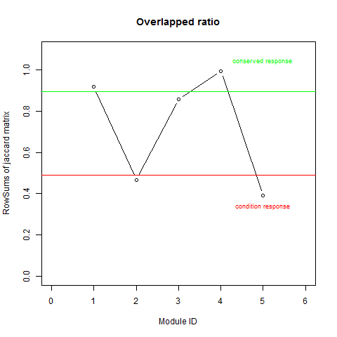

```{r setup, include=FALSE, message = FALSE}
knitr::opts_chunk$set(echo = TRUE)
```

# Motivation

Conventional differential expression analyses for RNA-sequencing and microarray take individual genes as basic units, where the interactions between genes were not fully considered. As a widely used form to represent the interactions among elements, graph (network) would has potential in this filed. Since a decade ago network biology [@barabasi2004network] has attracted much attention as a principle to understand functional organization. Gene co-expression network, in which a node stands for a gene and an edge means the co-expression level of a pair of genes, is one of the main forms of biological networks. And weighted gene co-expression network analysis (WGCNA) [@langfelder2008wgcna] has also become popular since the fantastic works by [Steve Horvath](https://scholar.google.co.uk/citations?user=mEM8q5cAAAAJ&hl=en) and his collabrators. 

The pricinple of WGCNA is to take the modules as basic units and try to understand the organism on a system level view. The proposed module differential analysis (MODA) [@Li053496] follows this principle and focus on modules identified from multiple networks. Because multiple networks can represent the same system under multple conditions or different systems sharing something in common. Comparing multiple networks by comparing modules from each network is a potential way to reveal the similarities and differences of these networks, on a system point of view. Here we embed parts of the examples from the package [MODA](https://bioconductor.org/packages/MODA) help pages into a single document.

# Networks construction

Given the gene expression matrix $X \in \mathbb{R}^{n\times p}$ with $n$ genes across $p$ replicates, the simpliest way to construct a weighted gene co-expression network is to calcuate the correlation matrix $W\in \mathbb{R}^{n\times n}$ as the adjacency matrix of the desired graph $G=(V,E)$, where $V$ is the node set and $E$ is the edge set. WGCNA suggests to raise the absolute value of the correlation to a power $\beta > 1$, i.e. the entries in $W$ is defined as,
$$w_{ij}=|cor(x_i,x_j)|^{\beta}$$
where the parameter $\beta$ is chosen by approximate scale-free topology criterion [@zhang2005general].

When involving multiple networks comparison, e.g. multiple stresses or environmental perturbations on the same species, it is idea to has enough replicates for each condition. Because the accurate correlation coefficient is approximated by $1/sqrt(k)$ where $k$ is the number of replicates. But requiring large replicates is difficult in practice. We use a sample-saving approach to construct condition-specific co-expression networks for each single condition in MODA. Assume network $N_1$ is background, normally containing samples from all conditions, is constructed based on the correlation matrix from all samples. Then condition $D$ specific network $N_2$ is constructed from all samples minus samples belong to certain condition $D$ [@kuijjer2015estimating]. The differences between network $N_1$ and $N_1$ is supposed to reveal the effects of condition $D$.

# Modules detection

Basic module detection functions are provided by WGCNA [@langfelder2008wgcna], which uses hierarchical clustering to find modules. The cutting height of dendrogram relies on user-defined value. MODA selects this parameter based on the maximization of average modularity or density of the resulted modules.

we conduct the experiment on the synthetic dataset which contains two expression profiles $datExpr1$ and $datExpr2$ with 500 genes, and each has 20 and 25 samples. Details of data generation can be found in supplementary file of MODA paper [@Li053496].

```{r}
library(MODA)
data(synthetic)
ResultFolder = 'ForSynthetic' # where middle files are stored
CuttingCriterion = 'Density' # could be Density or Modularity
indicator1 = 'X'     # indicator for data profile 1
indicator2 = 'Y'      # indicator for data profile 2
specificTheta = 0.1 #threshold to define condition specific modules
conservedTheta = 0.1#threshold to define conserved modules
##modules detection for network 1
intModules1 <- WeightedModulePartitionDensity(datExpr1,ResultFolder,
                                indicator1,CuttingCriterion)
##modules detection for network 2
intModules2 <- WeightedModulePartitionDensity(datExpr2,ResultFolder,
                                indicator2,CuttingCriterion)
```

The above code shows how to detect modules using hierecal clustering with the optimal cutting height of dendrogram. The heatmap of correlation matrix of gene expression profile 1 may looks like the following figure:

```{r}
png('ForSynthetic/heatdatExpr1.png')
heatmap(cor(as.matrix(datExpr1)))
dev.off()
```




The selection of optimal cutting height for each expression profile would be stored under directory $ResultFolder$. Another package [@kalinka2011linkcomm] has a similar function. Take $datExpr1$ in the synthetic data for example, a file named $Partitions\_X.pdf$ may looks the following figure:



At the same time, each module for each expression profile would be stored as plain text file, with the name indicator from $indicator1$ and $indicator2$. Each secondary directory under $ResultFolder$ has the same name of condition name, e.g $indicator2$, used to store differential analysis results.

# Networks comparison
After the module detection for background network and all condition-specific networks, we can compare them using following function

```{r}
CompareAllNets(ResultFolder,intModules1,indicator1,intModules2,
               indicator2,specificTheta,conservedTheta)
```

The condition specific networks can be specified by two vectors if there are more. There are three files under the secondary directory named by condition name: two text files of them are condition specific and conserved modules id from background network, and one pdf for showing how to determine these modules by two parameters $specificTheta$ and $conservedTheta$ based on a Jaccard index matrix. Theoretical details can be found in supplementary file of MODA paper. The figure may looks like the following figure:



# Biological explanation

Gene set enrichment analysis is the most feasible way to get biological explanation for us. Normally we use intergative tools like [DAVID](https://david.ncifcrf.gov) or [Enrichr](http://amp.pharm.mssm.edu/Enrichr), to see whether a module gene list can be explained by existing biological process, pathways or even diseases.

# Developer page

Please visit [MODA](https://github.com/fairmiracle/MODA) for new features.

# Session Information

Here is the output of `sessionInfo()` on the system on which this document was compiled:

```{r echo=FALSE}
sessionInfo()
```

# References
